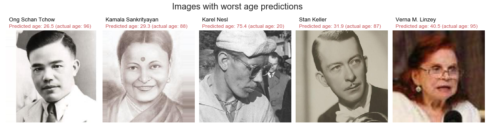

# Age and Gender Recognition with Tensoflow 

#### This project uses Google's inception v3 model with Tensorflow to predict the age and the gender of a person in a portrait, after training the model using 20000 wikipedia.org portraits from the [IMDB-WIKI dataset](https://data.vision.ee.ethz.ch/cvl/rrothe/imdb-wiki/). While an accuracy of 90.5% is achieved for gender (male/female) classification, the inception v3 model is unable to accurately predict age when trained on the wikipedia portraits database, with a Mean Absolute Error of 8.8 years. 

## Introduction

Determining the age and gender of a person using pictures or video can have numerous applications, including targeted recommendations in stores, adapting the contents of a video for younger audience, security control, etc. 

The purpose of this project is to estimate the gender and age of a person based on a portrait, using Google's [inception v3 model](https://www.tensorflow.org/tutorials/images/image_recognition) with Tensorflow. The inception v3 model is a deep convolutional neural network designed for computer vision classification, specifically trained to classify pictures of objects in the [ImageNet database](https://en.wikipedia.org/wiki/ImageNet). This model is then re-trained on about 20000 images of faces obtained from [wikipedia.org](https://en.wikipedia.org/wiki/Main_Page), with gender and age information available for each picture. 

Tensorflow offers a [tutorial](https://www.tensorflow.org/hub/tutorials/image_retraining) for retraining the inception v3 model using new categories provided by the user. In particular, the [retrain.py](https://github.com/tensorflow/hub/blob/master/examples/image_retraining/retrain.py) file provided for this tutorial is used in this project for creating bottlenecks for each picture (i.e. the 2048 outputs of the second-to-last layer of the convolutional neural network, which is essentially a method for converting a picture into 2048 useful features for classifying images) and for retraining the model for gender classification and age regression.

## Description and main results

### Data preparation

The pictures and metadata were downloaded from this [link](https://data.vision.ee.ethz.ch/cvl/rrothe/imdb-wiki/static/wiki_crop.tar).

The data is first cleaned by converting the date of birth from Matlab serial date number to pandas datetime. This allows the calculation of the age of the person in the picture by calculating the difference between the date when the picture was taken (obtained from image file metadata) and their date of birth.

Then, a random sample of 20000 images (10000 males and 10000 females) from this dataset is selected and the images are moved to a folder based on their gender (male & female folders) to allow the inception v3 re-training process by Tensorflow.

Because this sample of 20000 images was not perfectly clean (some portraits gender are mislabelled, mainly because of the face extraction algorithm to generate the portraits from Wikipedia pictures), it became necessary to remove the images with mislabelled gender manually. Since this is obviously a very time-consuming and tedious task (about 2 or 3 hours spent scanning rows of images to spot mislabeled gender), the cleaned dataset containing 19213 images is provided in this repository.

### Gender predictions

#### Gender predictions using Tensorflow

Then, using Tensorflow's retrain module, the gender of each person in the selected portrait database is predicted using cross-validation. For each validation fold, the remaining images are moved to a training folder and the inception v3 model is retrained on the specified labels for these training images. Then, for each image in the validation fold, the gender is predicted. Finally, the training data is moved back to the original folder. Because the most time-consuming part of this process is the generation of bottlenecks files by the inception v3 model for each image, they are also included in the repository. 

The cross-validated accuracy obtained by the re-trained model for predicting the gender in the portraits is 89.2%.

By looking at the mislabelled images in the figure below, it can be clearly seen that males with long hair are often mislabelled as females by the model, even when they possess some masculine facial features (strong jaw, facial hair, etc.). 

On the contrary, women with long blond hair are often successfully labelled with a confidence level close to 100%, as shown in the figure below.

In fact, if the average faces of a male and of a female are calculated and plotted (see figure below), it can be clearly seen that, despite the blur caused by averaging thousands of unaligned pictures, the typical male in the dataset has short hair while the typical female has long hair.

When plotting the renormalized difference between the average face of a female and that of a male, it is possible to identify the main difference between typical females and males in the dataset: females have darker spots along the side due to their typically long hair, their chin is lighter because they lack facial hair, their lips are redder (possibly due to the use of lipstick) and their eyes are darker (also possibly because of makeup). Incidentally, their clothes are slightly redder than that of males, which is probably not a very relevant criterion for classifying the gender of a person.

The figure below shows the confusion matrix for cross-validated gender predictions. Most errors correspond to females labelled as men by the model, and indeed, it can be observed that the average mislabelled female portrait looks very similar to the average correctly labelled male portrait, including the shorter hair and the average color of clothes.

All these observations show that the re-trained model bases its decisions mainly on spatial features and is probably unable to detect and analyse each facial feature independently (e.g. shape and size of jaw relative to the face, structure of the skin, etc...) as humans usually do. Indeed, a human can identify the gender for each image in this database with an accuracy close to 100%.

#### Gender predictions with Gradient Boosting classifier

By using the bottlenecks created by the inception v3 model for each picture as features, it is also possible to use another model to predict gender. In this project, the [light Gradient Boosting Machine (lightGBM)](https://lightgbm.readthedocs.io/en/latest/) classifier model (a [Gradient Boosting](https://en.wikipedia.org/wiki/Gradient_boosting) algorithm) is used, instead of inception's model last Softmax activation layer. LightGBM is known for both speed and accuracy performance for such structured problems (once the bottlenecks features are created, this project becomes a typical machine learning task). 

Indeed, the cross-validated predictions for gender with Tensorflow take about 48 hours of computation time on a laptop with reasonably good performances, or 24 hours if the bottlenecks files already exist (in which case most of the time is spent on image processing for predictions because the bottlenecks are already available for training the model). Instead, the LightGBM model is able to make cross-validated predictions in a few minutes because all the relevant information required for training and predictions is already contained in the bottlenecks files.

After optimizing the lightGBM model's [hyperparameters](https://en.wikipedia.org/wiki/Hyperparameter_(machine_learning)) (number of trees, depth of trees, minimum number of images per leaf, L1 and L2 regularization, etc.) using a self-made GridSearch function, the cross-validation accuracy for predicting gender is increased to 90.5% (instead of 89.2% for the inception model alone). The probability distributions for gender predictions are very skewed toward the correct label, as shown in the figure below. 

The graph below shows that the corresponding area under the [receiver operating characteristic curve](https://en.wikipedia.org/wiki/Receiver_operating_characteristic) (ROC AUC) is equal to 0.967 for the cross-validated data and 0.993 for the training data. This large difference indicates that the model is [overfitting the training data](https://en.wikipedia.org/wiki/Overfitting) (i.e. it "memorizes" the training data thanks to the large number of free parameters in the model), but its accuracy is nevertheless optimized for unseen validation data.

### Age predictions

Using the same bottlenecks as the ones generated by the retrain module for the gender labels (bottlenecks created by the inception model are independent of the training labels), it is also possible to train a lightGBM regressor model to predict the age of the person in each image.

Once optimized using a GridSearch function, the lightGBM regressor model was able to predict the age in the portraits with a [Mean Absolute Error](https://en.wikipedia.org/wiki/Mean_absolute_error) (MAE) of 8.8 years, and a [Root-Mean-Square Error](https://en.wikipedia.org/wiki/Root-mean-square_deviation) (RMSE) of 11.5 years. The figure below shows the predicted age from the pictures as a function of actual age for training and cross-validation data.

By comparison, [the best models](https://pdfs.semanticscholar.org/c570/2b45686cc4eb357627bbc8bb05e8c7281e8d.pdf) for predicting the age using face images lead to a MAE of around 3 years. This relatively poor performance by the inception v3 model may be explained by the fact that it has been optimized and pre-trained to classify thousands of item categories and was not designed for this age estimation regression task. Moreover, more successful models usually rely on a much larger dataset. While using the entire IMDB-WIKI database (500000 images) would improve predictions, the data was limited to 20000 images in this project to limit training time.

Nevertheless, this model does perform significantly better than a random guess, as can be demonstrated by shuffling the target data (i.e. age) in the dataset. In this case, while the model is able to overfit the training images to the randomized age (Pearson's correlation coefficient: 0.93), this correlation disappears for the validation data (Pearson's correlation coefficient: 0.0), as shown in the figure below. The associated MAE and RMSE are 13.5 years and 16.7 years, respectively.

In the picture below are shown the average portraits for different age groups, as predicted by the model. Despite the fact that these averaged pictures are blurry, some of the main features of aging can be observed, including grey hair and receding hairline. Once again, the color of the clothes appears to be a significant factor for predicting the age (older people tend to have darker clothes), which may explain some of the errors made by the model.

Unlike gender, the database cannot be cleaned manually in a reasonable amount of time (since age is continuous and much harder to estimate than gender for humans). However, some of the worst absolute errors made by the model are caused by mislabelled age in the training data as seen in the figure below.

### Conclusions

Using the bottleneck features created by the inception v3 model, the gradient boosting model (lightGMB) is able to predict the gender of a person in an image with a 90.5% accuracy. This model is however unable to accurately predict the age of the person, with a mean absolute error of 8.8 years.

## How to use

Start by cloning this repository and opening [this notebook](https://github.com/Bougeant/Age_and_Gender_Recognition/blob/master/Age%20and%20Gender%20Recognition.ipynb) wih jupyter. The pictures and metadata must then be downloaded from this [link](https://data.vision.ee.ethz.ch/cvl/rrothe/imdb-wiki/static/wiki_crop.tar), and extracted to the ./data directory.

To save some time (24 to 48 hours), it is recommended to skip the Tensorflow model training and to read the wiki_metadata.csv file directly. This repository already includes the verified gender images (about 19000 pictures) and the tensorflow bottlenecks for these images to save time and effort.

In addition to the main data science Python libraries (numpy, pandas, seaborn, sklearn, etc...), this notebook requires the installation of the following modules:
 - Tensorflow: v1.8.0
 - Tensorflow_hub: v0.1.1
 - PIL: v4.2.1
 - lightgbm: v2.1.2
 
Once Tensorflow is installed, it is necessary to replace "_sys.exit(main(argv))" by "main(argv)" in app.py (/Anaconda3/Lib/site-packages/tensorflow/python/platform/app.py) to avoid a SystemError (as sys.exit function attempts to close python which is prevented by jupyter notebook).

## Credits

- IMDB-WIKI portraits dataset: https://data.vision.ee.ethz.ch/cvl/rrothe/imdb-wiki/

- Tensorflow: How to Retrain an Image Classifier for New Categories: https://www.tensorflow.org/hub/tutorials/image_retraining
